# Pipeline Completo de PLN sobre o Corpus BBC News

## Identificação

- **Aluno:** Anderson Correa
- **Disciplina:** Processamento de Linguagem Natural (Sistemas Cognitivos e Linguagem Natural)
- **Título do projeto:** Pipeline Completo de PLN sobre o Corpus BBC News
- **Repositório (reprodução):** https://github.com/andersonfpcorrea/26E2_2

---

## Acesso aos artefatos

> Todos os artefatos do projeto (notebook executado, dados, figuras, modelos e grafo) estão no repositório público abaixo. O notebook é renderizado diretamente pelo GitHub **com todas as saídas e gráficos visíveis no navegador**, sem necessidade de instalação.
>
> - **Repositório:** https://github.com/andersonfpcorrea/26E2_2
> - **Notebook executado (renderizado no GitHub):** https://github.com/andersonfpcorrea/26E2_2/blob/master/notebooks/pln_pipeline.ipynb
> - **Notebook executado (alternativa via nbviewer):** https://nbviewer.org/github/andersonfpcorrea/26E2_2/blob/master/notebooks/pln_pipeline.ipynb
> - **Versão estática em HTML:** `notebooks/pln_pipeline.html` no repositório
> - **Arquivos auxiliares:** `data/` (corpus + dados pré-processados), `outputs/figures/`, `outputs/models/`, `outputs/graph/`

---

## Descrição do corpus

O corpus utilizado é o **BBC News**, um conjunto de dados clássico em Processamento de Linguagem Natural, publicado por D. Greene e P. Cunningham no âmbito do artigo _"Practical Solutions to the Problem of Diagonal Dominance in Kernel Document Clustering"_ (ICML 2006). Trata-se de uma coleção de **2.225 documentos** jornalísticos em **inglês**, extraídos do portal de notícias da BBC, organizados em **cinco categorias temáticas mutuamente exclusivas**:

| Categoria     | Documentos |
| ------------- | ---------: |
| business      |        510 |
| entertainment |        386 |
| politics      |        417 |
| sport         |        511 |
| tech          |        401 |
| **Total**     |  **2.225** |

Cada documento corresponde a uma notícia completa (manchete seguida do corpo do texto). O comprimento médio é de aproximadamente **384 palavras por documento** no texto bruto, caindo para cerca de **199 tokens por documento** após a etapa de limpeza e lematização. O vocabulário limpo resultante contém aproximadamente **21.958 termos distintos**.

A distribuição entre classes é razoavelmente equilibrada — nenhuma categoria domina excessivamente o conjunto — embora exista uma diferença relevante entre a menor classe (_entertainment_, 386) e a maior (_sport_, 511). Esse leve desbalanceamento é tratado explicitamente na etapa de classificação por meio de ponderação de classes.

---

## Link e instruções de obtenção do corpus

- **Página oficial do dataset:** http://mlg.ucd.ie/datasets/bbc.html
- **Arquivo de texto integral utilizado:** `http://mlg.ucd.ie/files/datasets/bbc-fulltext.zip`

A obtenção é totalmente automatizada pelo script `scripts/download_corpus.py`, que faz o download do arquivo `bbc-fulltext.zip`, percorre a estrutura de uma pasta por categoria (cada uma contendo arquivos `.txt` individuais), decodifica o conteúdo (codificação UTF-8 na origem) e consolida tudo em um único arquivo `data/bbc_news.csv` com as colunas `id`, `category`, `title` e `text`. Esse CSV é versionado no repositório, de modo que a execução do notebook não depende de acesso à rede.

---

## Justificativa para escolha do corpus

A escolha do BBC News se sustenta em vários critérios que o tornam ideal para um pipeline didático e ao mesmo tempo representativo de problemas reais de PLN:

1. **Rótulos confiáveis e bem definidos.** As cinco categorias são jornalisticamente curadas e mutuamente exclusivas, o que oferece uma referência (_ground truth_) sólida para avaliação supervisionada e para validar a qualidade da modelagem de tópicos não supervisionada.
2. **Tamanho equilibrado.** Com 2.225 documentos, o corpus é grande o bastante para que modelos estatísticos aprendam padrões úteis, mas pequeno o suficiente para ser processado integralmente em uma máquina pessoal, sem necessidade de infraestrutura distribuída — uma decisão consciente de custo e reprodutibilidade.
3. **Prosa rica em entidades.** Notícias mencionam pessoas, organizações, locais, datas, valores monetários e percentuais com alta densidade, o que torna o corpus particularmente adequado para Reconhecimento de Entidades Nomeadas (NER) e para a construção de um grafo de conhecimento por coocorrência.
4. **Diversidade de domínios.** A presença simultânea de negócios, política, esporte, entretenimento e tecnologia produz um vocabulário variado e tópicos visivelmente distintos, o que facilita a interpretação tanto de representações vetoriais quanto de modelos de tópicos.
5. **Reconhecimento acadêmico.** É um _benchmark_ amplamente citado, o que permite contextualizar os resultados obtidos frente à literatura.

---

## Caracterização inicial dos dados

Antes de qualquer modelagem, o corpus foi caracterizado de forma exploratória para entender sua estrutura e guiar as decisões de pré-processamento. As principais observações foram a distribuição de classes (apresentada acima), a distribuição de comprimento dos documentos, os termos mais frequentes e a distribuição de classes gramaticais (POS).

A distribuição de comprimento dos documentos revela uma cauda longa típica: a maioria das notícias é curta a moderada, com um número menor de reportagens longas que esticam a média acima da mediana.

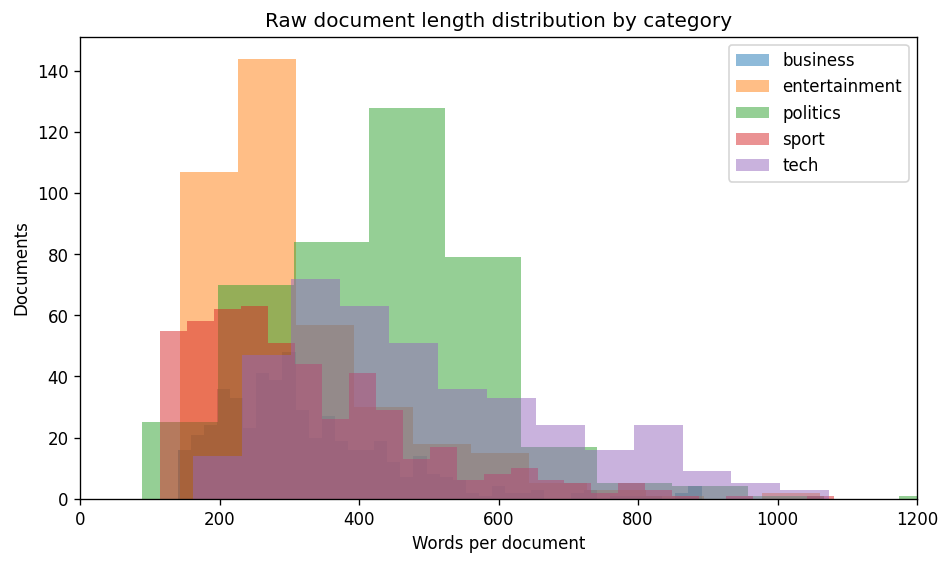

A nuvem de palavras e o ranking de termos mais frequentes após a limpeza confirmam que os tokens remanescentes carregam sinal temático — e não ruído de preenchimento — validando a estratégia de stopwords customizadas descrita adiante.

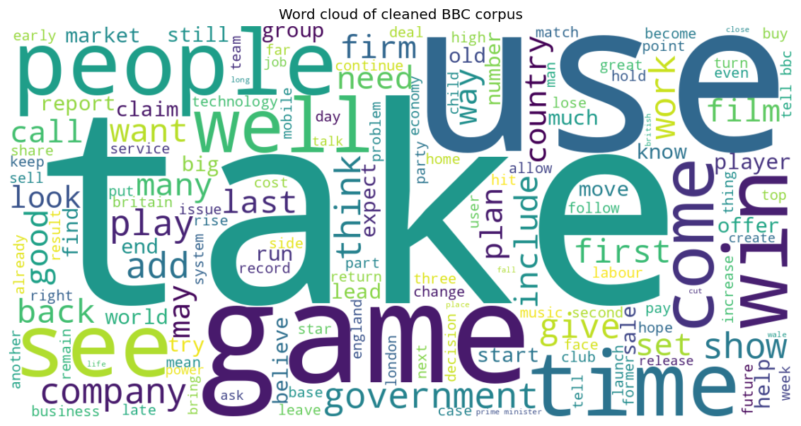

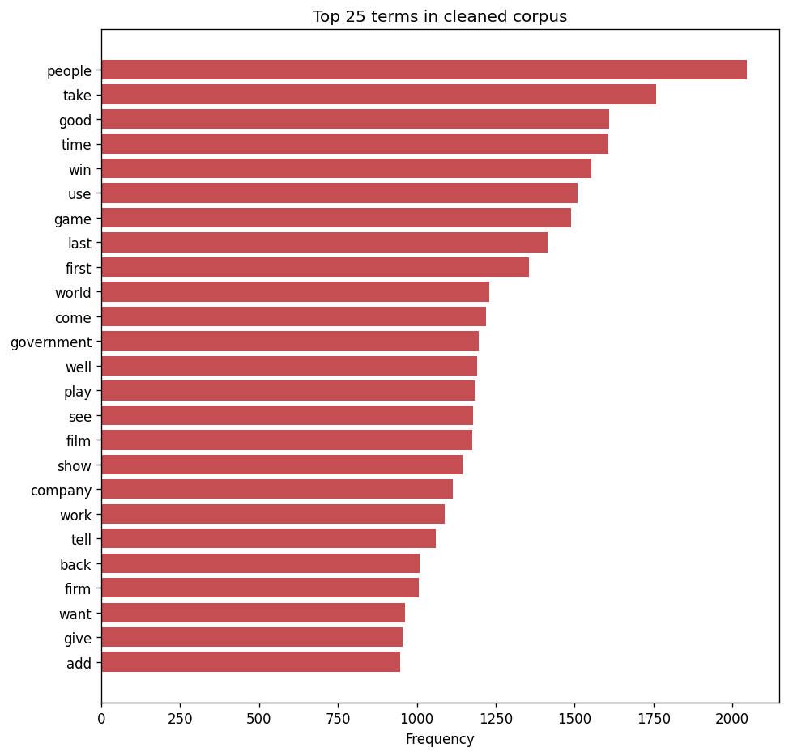

A análise de classes gramaticais (POS) com spaCy mostra a predominância de substantivos e nomes próprios, coerente com a natureza informativa e factual do texto jornalístico.

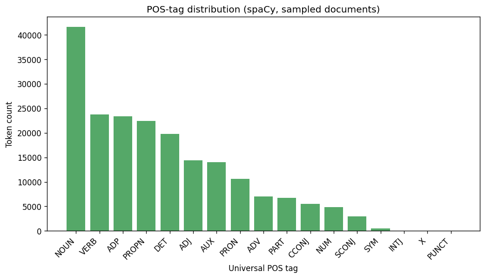

**Comprimento dos documentos por categoria (palavras no texto bruto):**

| Categoria     | Média | Mediana | Desvio-padrão |
| ------------- | ----: | ------: | ------------: |
| business      | 328,9 |   297,0 |         135,9 |
| entertainment | 330,6 |   262,5 |         261,8 |
| politics      | 454,0 |   439,0 |         300,1 |
| sport         | 329,3 |   288,0 |         188,0 |
| tech          | 502,7 |   447,0 |         239,8 |

A média global é de **384,0 palavras/documento** no texto bruto e **199,3 tokens/documento** após a limpeza. As categorias _tech_ e _politics_ têm as reportagens mais longas; a mediana abaixo da média em todas as classes confirma a cauda longa.

**Termos mais frequentes no corpus limpo (com contagens):** people (2.046), take (1.759), good (1.609), time (1.607), win (1.552), use (1.509), game (1.488), last (1.414), first (1.356), world (1.229), come (1.219), government (1.196), well (1.192), play (1.184), see (1.178). Note-se que mesmo após a remoção de stopwords customizadas restam alguns termos genéricos (_take_, _time_, _good_) — comuns a todas as editorias —, ao lado de termos já temáticos (_win_, _game_, _government_).

---

## Descrição do pipeline de pré-processamento

O pré-processamento é tratado como um **contrato congelado**: o script `scripts/build_processed.py` executa toda a limpeza uma única vez e persiste o resultado em `data/processed.parquet`. Esse arquivo é a _única fonte de verdade_ consumida por todas as seções subsequentes do notebook (vetorização, classificação, tópicos, NER). Centralizar a limpeza garante que cada etapa opere exatamente sobre o mesmo texto tratado, eliminando inconsistências entre seções.

O pipeline executa, em ordem:

1. **Normalização.** Conversão para minúsculas e remoção de tudo que não seja letras ASCII e espaços (pontuação e dígitos são descartados). Espaços redundantes são colapsados.
2. **Tokenização.** Tokenização de palavras e de sentenças com o NLTK na fase exploratória; o pipeline canônico usa o tokenizador do spaCy ao processar o texto normalizado.
3. **Remoção de stopwords.** União das stopwords padrão do NLTK (inglês) com um conjunto **customizado de domínio jornalístico** — verbos de citação e termos de preenchimento de altíssima frequência que sobrevivem à remoção genérica mas não carregam sinal temático, como `said`, `say`, `mr`, `would`, `could`, `also`, `told`, `added`, `new`, entre outros.
4. **Lematização.** Redução de cada token à sua forma canônica (lema) com o modelo `en_core_web_sm` do spaCy. Tokens com menos de três caracteres ou que não sejam puramente alfabéticos são descartados.
5. **POS tagging.** Anotação de classes gramaticais com spaCy, usada na caracterização exploratória.

O resultado é materializado na coluna canônica **`clean_text`**, acompanhada das colunas auxiliares `tokens`, `n_words_raw` e `n_words_clean`.

---

## Comparação entre stemming e lematização

Um ponto central do projeto é a comparação explícita entre **stemming** (algoritmo de Porter, via NLTK) e **lematização** (spaCy), e a justificativa da escolha adotada.

- O **stemming** aplica regras heurísticas de corte de sufixos. É rápido e agressivo, mas frequentemente produz radicais não lexicais — por exemplo, _"organisation"_ → _"organis"_, _"business"_ → _"busi"_, _"studies"_ → _"studi"_. Esses radicais agregam variantes morfológicas sob um mesmo símbolo, o que pode ajudar em recuperação de informação, mas são ilegíveis para um leitor humano.
- A **lematização** usa conhecimento morfológico e contexto gramatical para mapear cada palavra ao seu lema dicionarizado — _"studies"_ → _"study"_, _"better"_ → _"good"_, _"running"_ → _"run"_ — sempre produzindo palavras reais.

A decisão de projeto foi adotar a **lematização** como base da coluna canônica `clean_text`. A motivação é que os tokens limpos não servem apenas como entrada numérica para os modelos: eles aparecem diretamente nos resultados do **motor de busca**, nas **palavras-chave dos tópicos** (LDA/NMF) e nos **rótulos dos nós do grafo de conhecimento**. A lematização preserva a legibilidade sem sacrificar significativamente a capacidade de agrupar variantes morfológicas.

**Impacto no tamanho do vocabulário** (mesma base de tokens, sem stopwords):

| Técnica               | Vocabulário | Redução vs. base |
| --------------------- | ----------: | ---------------: |
| Base (sem stopwords)  |      27.518 |             0,0% |
| Stemming (Porter)     |      18.806 |            31,7% |
| Lematização (WordNet) |      24.549 |            10,8% |

O stemming colapsa o vocabulário quase três vezes mais que a lematização — mas à custa da legibilidade, como mostram os exemplos:

| Palavra         | Stemming (Porter) | Lematização (WordNet) |
| --------------- | ----------------- | --------------------- |
| studies         | studi             | study                 |
| studying        | studi             | studying              |
| national        | nation            | national              |
| nationalisation | nationalis        | nationalisation       |
| running         | run               | running               |
| organisation    | organis           | organisation          |
| policies        | polici            | policy                |
| companies       | compani           | company               |

Observa-se que o Porter gera radicais não lexicais (_studi_, _polici_, _organis_, _compani_), enquanto o WordNet preserva palavras dicionarizadas. Confirma-se a decisão de adotar a lematização (spaCy) na coluna canônica.

---

## Descrição das representações vetoriais

Foram construídas e comparadas múltiplas representações vetoriais do corpus, cobrindo desde abordagens esparsas baseadas em contagem até embeddings densos distribuídos:

1. **Bag-of-Words (BoW).** Vetorização por contagem de termos com o `CountVectorizer` do scikit-learn. Representação esparsa, simples e interpretável, que ignora ordem das palavras.
2. **TF-IDF com n-gramas (1–2).** Ponderação _term frequency–inverse document frequency_, incluindo unigramas e bigramas, para valorizar termos discriminativos e capturar expressões compostas (ex.: _"prime minister"_, _"box office"_). É a representação central do projeto, usada tanto na classificação quanto no motor de busca.
3. **Word2Vec.** Embeddings densos treinados com o gensim sobre o próprio corpus, capturando relações semânticas distribucionais entre palavras.
4. **Similaridade de cosseno.** Métrica de proximidade entre vetores de documentos e termos, fundamento do motor de busca e das análises de vizinhança.
5. **t-SNE.** Projeção não linear dos vetores TF-IDF em duas dimensões para visualização da separabilidade entre as cinco categorias.

A projeção t-SNE evidencia o grau de separação natural entre os domínios temáticos do corpus, oferecendo uma validação visual da qualidade das representações antes da modelagem supervisionada.

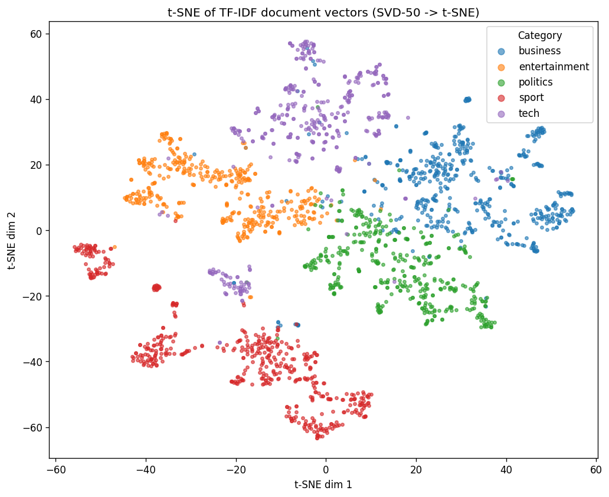

Os termos de maior peso TF-IDF por categoria confirmam que a representação captura vocabulário discriminativo e coerente com cada domínio.

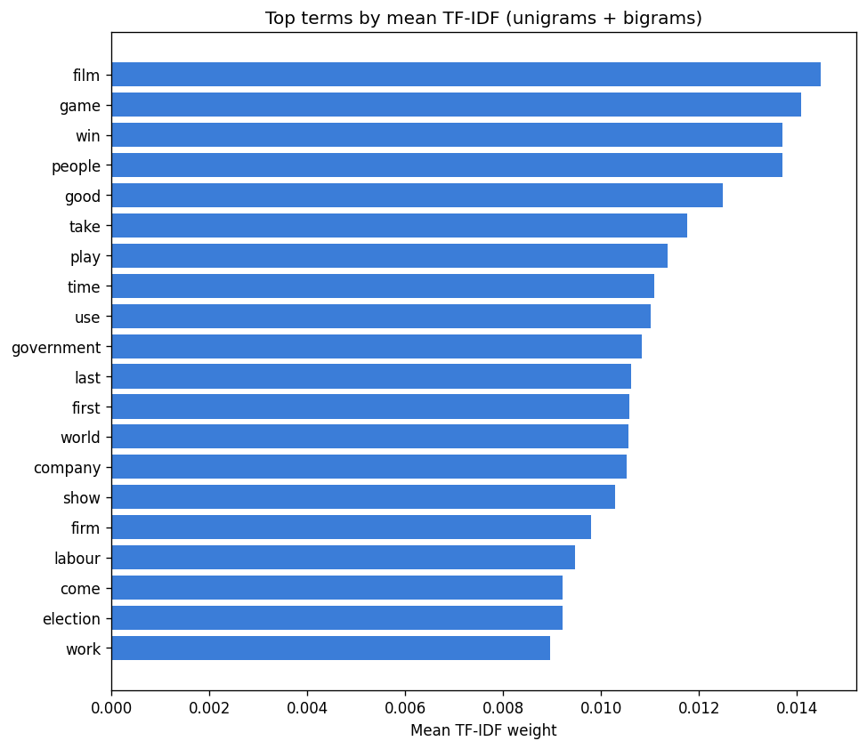

**Dimensões das matrizes:** a matriz **Bag-of-Words** tem dimensão **2.225 × 21.958** (documentos × termos unigramas). A matriz **TF-IDF com bigramas** (`ngram_range=(1,2)`, `min_df=2`, `max_df=0.9`) expande para **2.225 × 76.012**, pois os bigramas multiplicam o espaço de atributos.

**Vizinhos semânticos do Word2Vec** (vocabulário de 8.152 termos, `min_count=5`):

- _government_ → call (0,927), security (0,924), plan (0,910), firm (0,909), software (0,907)
- _film_ → award (0,973), star (0,894), good (0,884), actor (0,881), prize (0,875)
- _market_ → speed (0,949), cost (0,947), increase (0,946), income (0,945), level (0,940)

Os vizinhos de _film_ são especialmente coerentes (prêmios, estrelas, atores). Para _government_ e _market_ a vizinhança é plausível, mas mais difusa — efeito esperado de embeddings treinados em um corpus pequeno (2.225 documentos), o que é registrado nas limitações.

---

## Evidências do motor de busca textual

Foi implementado um **motor de busca textual** baseado em similaridade de cosseno sobre a representação **TF-IDF**. Dada uma consulta em linguagem natural, o motor: (1) aplica à consulta exatamente o mesmo pré-processamento dos documentos, (2) projeta a consulta no espaço TF-IDF treinado, (3) calcula a similaridade de cosseno contra todos os documentos do corpus e (4) retorna os documentos mais relevantes, ordenados por pontuação, junto com sua categoria e um trecho.

Essa arquitetura demonstra na prática como recuperação de informação clássica pode ser construída sobre as mesmas representações usadas na classificação, reaproveitando o pipeline de limpeza e evitando duplicação de lógica.

Foram testadas três consultas de domínios distintos. Os resultados (top-5, com categoria e score de cosseno) mostram alta precisão temática:

**Consulta 1 — "stock market interest rates and economy":**

| #   | Categoria | Título                            | Score |
| --- | --------- | --------------------------------- | ----: |
| 1   | business  | Booming markets shed few tears    | 0,293 |
| 2   | business  | Standard Life cuts policy bonuses | 0,268 |
| 3   | business  | Axa Sun Life cuts bonus payments  | 0,200 |
| 4   | business  | Markets signal Brazilian recovery | 0,190 |
| 5   | business  | Australia rates at four year high | 0,184 |

**Consulta 2 — "football championship final match":**

| #   | Categoria | Título                            | Score |
| --- | --------- | --------------------------------- | ----: |
| 1   | sport     | SA return to Mauritius            | 0,221 |
| 2   | sport     | Wilkinson return 'unlikely'       | 0,156 |
| 3   | sport     | Legendary Dutch boss Michels dies | 0,138 |
| 4   | tech      | Football Manager scores big time  | 0,133 |
| 5   | sport     | Johnson announces June retirement | 0,125 |

**Consulta 3 — "new smartphone mobile technology":**

| #   | Categoria | Título                           | Score |
| --- | --------- | -------------------------------- | ----: |
| 1   | tech      | 'Friends fear' with lost mobiles | 0,226 |
| 2   | tech      | Mobile TV tipped as one to watch | 0,223 |
| 3   | tech      | Half of UK's mobiles 'go online' | 0,192 |
| 4   | tech      | Mobiles 'not media players yet'  | 0,187 |

**Comentário:** as três consultas retornam documentos da categoria esperada. A consulta 1 traz exclusivamente _business_; a consulta 3, exclusivamente _tech_ sobre celulares. Na consulta 2, o quarto resultado é de _tech_ ("Football Manager") — um caso ilustrativo de ambiguidade léxica: o documento fala de um _videogame_ de futebol, compartilhando vocabulário com a consulta. Os scores baixos (0,12–0,29) são esperados em consultas curtas contra documentos longos, mas a ordenação por relevância é coerente com o domínio.

---

## Descrição das técnicas de tópicos, classificação e sentimento

O projeto aborda a modelagem em duas frentes complementares: uma **supervisionada** (classificação) e uma **não supervisionada** (modelagem de tópicos). A análise de sentimento foi deliberadamente descartada, com justificativa.

### Classificação supervisionada

Três classificadores foram treinados sobre a representação TF-IDF para prever a categoria do documento:

- **Naive Bayes multinomial** — _baseline_ probabilístico clássico para texto.
- **SVM linear** — fronteiras de decisão de margem máxima, historicamente forte em classificação de texto esparso de alta dimensão.
- **Regressão Logística** — modelo linear probabilístico, configurado com `class_weight` balanceado para compensar o leve desbalanceamento entre as cinco classes.

A avaliação usa _precision_, _recall_, _F1-score_ (por classe e médias) e matriz de confusão, sobre uma divisão treino/teste estratificada.

### Modelagem de tópicos

Duas técnicas foram aplicadas, ambas configuradas para **5 tópicos** (espelhando o número de categorias, para permitir comparação qualitativa com os rótulos reais):

- **LDA (Latent Dirichlet Allocation)** — modelo generativo probabilístico de tópicos.
- **NMF (Non-negative Matrix Factorization)** — fatoração matricial sobre a matriz TF-IDF, que tende a produzir tópicos mais nítidos em corpora de tamanho moderado.

### Justificativa para NÃO usar análise de sentimento

A análise de sentimento foi **conscientemente excluída** do pipeline. Notícias jornalísticas são escritas em prosa predominantemente **neutra e factual**: o objetivo do gênero é informar, não expressar opinião. Aplicar um classificador de sentimento lexical a esse corpus agregaria **ruído em vez de sinal** — a polaridade detectada refletiria, na maioria dos casos, o vocabulário do tópico (ex.: termos de mercado ou de conflito) e não uma atitude do autor. Como o sentimento não é uma propriedade informativa nem rotulada neste corpus, incluí-lo comprometeria a clareza analítica sem benefício. Essa é uma decisão de projeto orientada pela natureza dos dados.

---

## Métricas e visualizações dos modelos

O desempenho dos três classificadores é comparado por _accuracy_, _precision_, _recall_ e _F1_, identificando o melhor modelo, cuja matriz de confusão é analisada em detalhe.

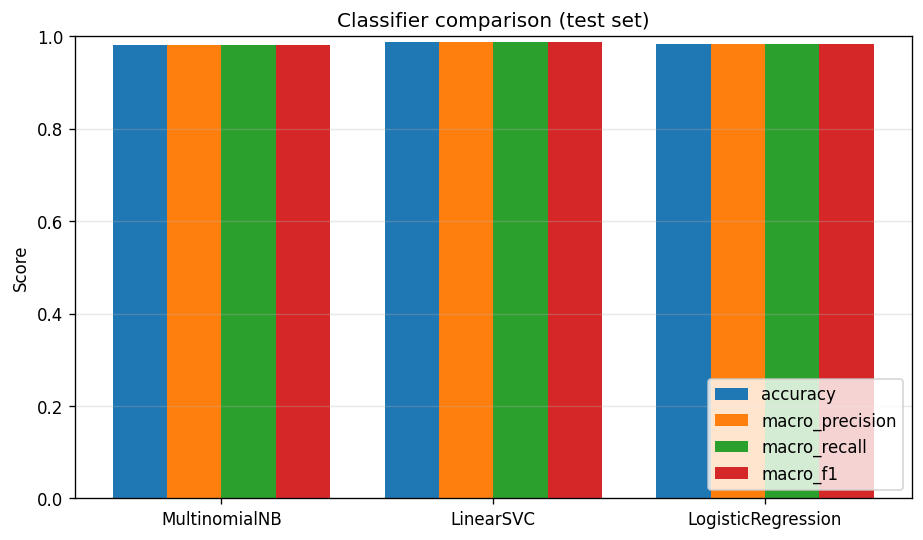

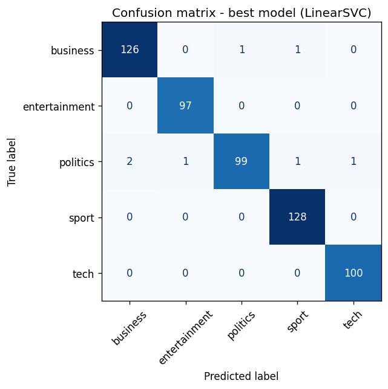

**Comparação dos classificadores (conjunto de teste, 557 documentos, médias macro):**

| Modelo             |   Accuracy |  Precision |     Recall |         F1 |
| ------------------ | ---------: | ---------: | ---------: | ---------: |
| MultinomialNB      |     0,9820 |     0,9819 |     0,9811 |     0,9815 |
| **LinearSVC**      | **0,9874** | **0,9878** | **0,9873** | **0,9874** |
| LogisticRegression |     0,9838 |     0,9837 |     0,9838 |     0,9837 |

O **melhor modelo é o LinearSVC** (F1-macro 0,9874), seguido de perto pela Regressão Logística. Todos superam 98% — evidência de que as cinco editorias são linguisticamente muito separáveis. O SVM linear se destaca por maximizar a margem entre classes em espaços esparsos de alta dimensão, exatamente o cenário do TF-IDF.

**Leitura da matriz de confusão (LinearSVC):** o modelo erra apenas **6 dos 557 documentos** de teste. As categorias _entertainment_, _sport_ e _tech_ são classificadas **sem nenhum erro**. A única confusão recorrente e bidirecional é **politics ↔ business**: _politics_ é a classe mais propensa a erro (perde documentos para business, entertainment, sport e tech), e _business_ perde alguns documentos para _politics_. Esse padrão é **semanticamente justificável** — política e economia compartilham vocabulário de governo, impostos, mercado e orçamento —, e coincide com a adjacência observada entre esses dois clusters na projeção t-SNE.

Na modelagem de tópicos, os tópicos extraídos pelo NMF são apresentados por suas palavras de maior peso, permitindo associá-los às categorias reais do corpus.

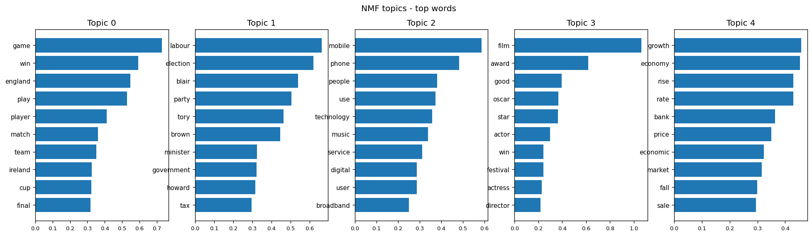

**Tópicos do NMF (TF-IDF) — top-10 palavras e mapeamento para categoria:**

| Tópico | Palavras principais                                                              | Categoria     |
| -----: | -------------------------------------------------------------------------------- | ------------- |
|      0 | game, win, england, play, player, match, team, ireland, cup, final               | sport         |
|      1 | labour, election, blair, party, tory, brown, minister, government, howard, tax   | politics      |
|      2 | mobile, phone, people, use, technology, music, service, digital, user, broadband | tech          |
|      3 | film, award, good, oscar, star, actor, win, festival, actress, director          | entertainment |
|      4 | growth, economy, rise, rate, bank, price, economic, market, fall, sale           | business      |

**Tópicos do LDA (contagens) — top-10 palavras:**

| Tópico | Palavras principais                                                            |
| -----: | ------------------------------------------------------------------------------ |
|      0 | good, film, win, play, game, award, star, time, take, first                    |
|      1 | company, firm, market, rise, sale, bank, share, month, price, growth           |
|      2 | labour, party, government, election, people, minister, blair, tory, plan, tell |
|      3 | win, first, play, set, open, last, final, game, match, take                    |
|      4 | use, people, game, mobile, technology, phone, service, user, take, music       |

**Coerência:** o **NMF recupera quase perfeitamente as cinco editorias** (um tópico nítido por categoria), confirmando que a estrutura temática latente do corpus reproduz a taxonomia editorial. O **LDA** chega a uma estrutura semelhante (política no tópico 2, negócios no tópico 1, tecnologia no tópico 4), mas é mais difuso: mistura esporte e entretenimento entre os tópicos 0 e 3. Isso ilustra a vantagem prática do NMF sobre TF-IDF para tópicos interpretáveis em corpora de tamanho moderado. O fato de um método **não supervisionado** redescobrir as classes valida a qualidade do pré-processamento e da representação.

---

## Descrição da extração de entidades

A extração de informação combina três técnicas complementares:

1. **NER com spaCy.** O modelo `en_core_web_sm` identifica entidades nomeadas e seus tipos (pessoas, organizações, locais, datas, valores monetários, etc.).
2. **Regex.** Padrões de expressão regular extraem estruturas com formato previsível que complementam o NER — **datas**, **valores monetários** e **percentuais**.
3. **Normalização fuzzy.** Para consolidar menções variantes da mesma entidade (ex.: _"Tony Blair"_ vs _"Mr Blair"_, ou variações de grafia/pontuação), aplica-se correspondência aproximada baseada em **distância de Levenshtein** via biblioteca `rapidfuzz`. Esse passo reduz a fragmentação de entidades e é essencial para que o grafo agregue corretamente as coocorrências.

A distribuição dos tipos de entidade e as entidades mais frequentes oferecem uma visão agregada de quem e o que domina o corpus.

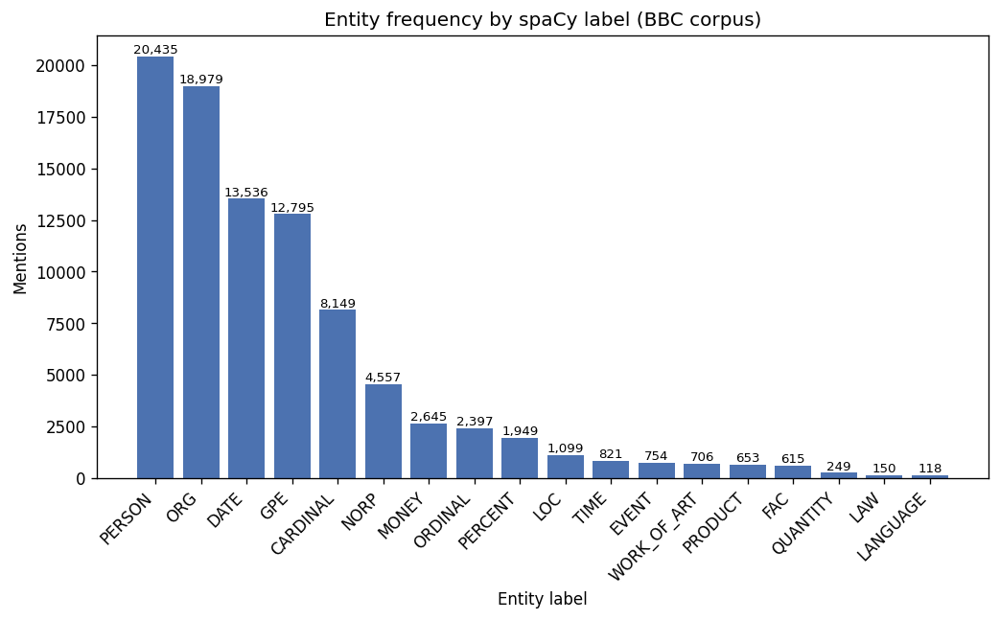

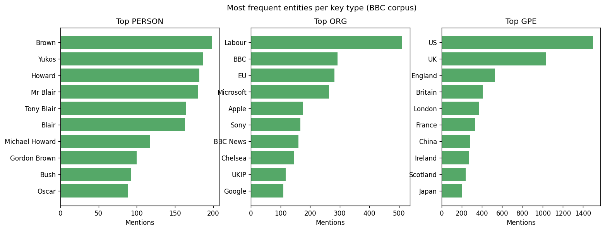

**Distribuição por tipo de entidade (spaCy NER):** PERSON (20.435), ORG (18.979), DATE (13.536), GPE (12.795), CARDINAL (8.149), NORP (4.557), MONEY (2.645), ORDINAL (2.397), PERCENT (1.949), LOC (1.099), entre outros. A predominância de PERSON e ORG é típica de prosa jornalística.

**Entidades mais mencionadas (geral):** US (1.496), UK (1.035), England (546), Labour (532), British (439), Britain (406). O eixo geopolítico britânico-internacional aparece imediatamente.

**Extração por regex:** valores monetários — 2.704 ocorrências (ex.: `$1.13bn`, `£600m`, `$639m`); percentuais — 1.971 (ex.: `76%`, `2%`, `8%`); datas — 1.861 (ex.: `Friday`, `Thursday`); e-mails — 0 (ausentes na prosa da BBC); URLs — 3 (ex.: `www.arsenal.com`).

**Normalização fuzzy (rapidfuzz, distância de Levenshtein):** das **23.569** formas de superfície distintas, **4.794** foram fundidas, resultando em **18.769** entidades canônicas. A etapa primeiro remove pronomes de tratamento e sufixos corporativos (_Mr_, _Inc_, _Corp_) e depois agrupa formas com `token_sort_ratio >= 88`, unindo variantes como "Tony Blair"/"Mr Blair" — passo essencial para que o grafo agregue corretamente as coocorrências.

---

## Explicação do grafo de conhecimento

A partir das entidades extraídas e normalizadas, foi construído um **grafo de conhecimento** com a biblioteca **NetworkX** (com **mais de 20 nós**). A semântica do grafo é a **coocorrência de entidades**: cada nó representa uma entidade e cada aresta liga duas entidades que aparecem juntas no mesmo documento, ponderada pela frequência de coocorrência. A intuição é que entidades que aparecem repetidamente lado a lado tendem a estar semanticamente ou factualmente relacionadas.

Sobre essa estrutura foram calculadas medidas de **centralidade**:

- **Centralidade de grau** — quantas conexões diretas cada entidade possui; identifica os atores mais "presentes" no corpus.
- **Centralidade de intermediação (betweenness)** — quão frequentemente uma entidade está nos caminhos mais curtos entre outras; identifica entidades que funcionam como "pontes" entre domínios distintos.

O grafo é visualizado de duas formas: uma figura estática (matplotlib) e uma versão interativa em HTML (PyVis), salva em `outputs/graph/`.

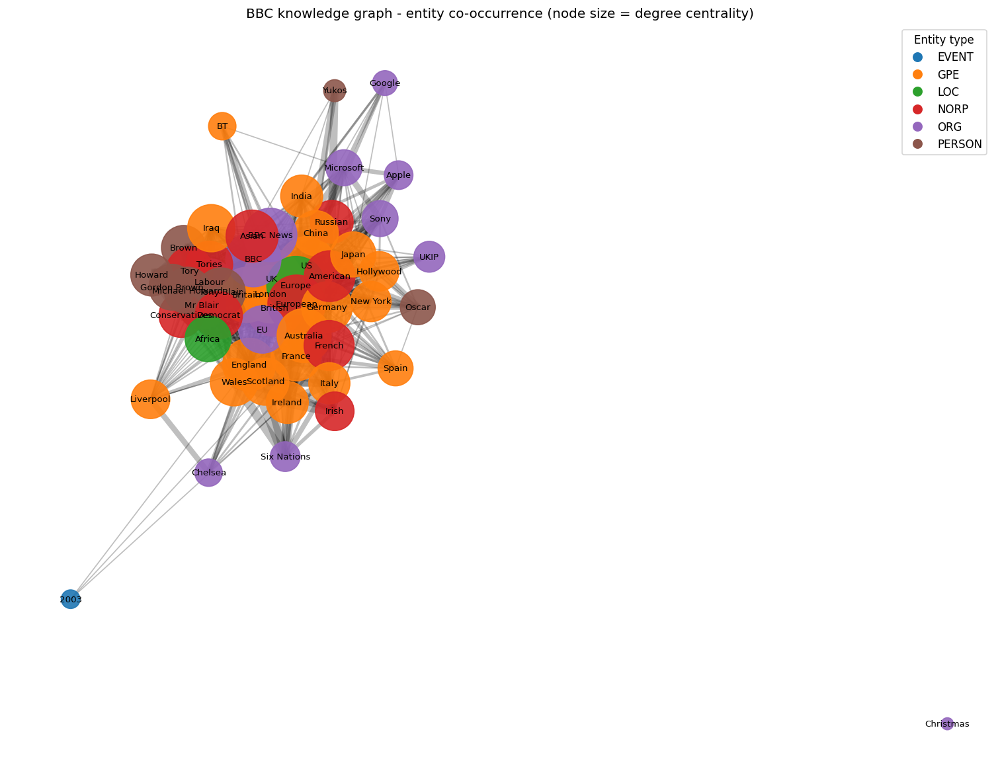

Por fim, o grafo é usado para responder a uma **pergunta analítica** concreta, demonstrando que a estrutura não é apenas decorativa, mas suporta consultas sobre as relações latentes no corpus.

**Estrutura do grafo:** **55 nós** e **757 arestas** (entidades dos tipos PERSON, ORG, GPE, NORP, LOC, FAC e EVENT; arestas com peso ≥ 3).

**Top entidades por centralidade de grau:** UK (0,926), Europe (0,889), US (0,870), London (0,870), European (0,870), British (0,852), Britain (0,796), BBC (0,796), Australia (0,759).

**Top entidades por centralidade de intermediação (betweenness):** Liverpool (0,136), Germany (0,060), India (0,053), Australia (0,044), Japan (0,041), Oscar (0,041), Iraq (0,038), Google (0,037), French (0,034), France (0,033).

**Pergunta analítica:** _Quais entidades são os principais conectores na cobertura da BBC e o que isso revela sobre a agenda editorial?_

**Resposta apoiada no grafo:** as duas centralidades contam histórias complementares. Pela **centralidade de grau**, dominam entidades geopolíticas nacionais — _UK_, _Europe_, _US_, _London_ —, revelando que a cobertura se organiza em torno de um **núcleo britânico de alcance internacional** que coocorre com quase tudo. Já a **centralidade de intermediação** destaca entidades de nicho — _Liverpool_, _Oscar_, _Google_, _Hollywood_ — que funcionam como **pontes** entre comunidades temáticas distintas (esporte, entretenimento, tecnologia). Em outras palavras: os hubs nacionais conectam o grafo de forma densa, enquanto entidades específicas costuram domínios que de outra forma estariam separados — uma leitura que só emerge da estrutura relacional, não da simples contagem de frequência.

---

## Interpretação dos resultados

Esta seção consolida a leitura integrada de todas as etapas: o que as representações revelaram sobre a separabilidade das classes, como os classificadores se comportaram e onde erraram, em que medida os tópicos não supervisionados recuperaram as categorias reais, e que estrutura relacional o grafo expôs.

De modo geral, espera-se que o corpus seja altamente separável (domínios temáticos distintos produzem vocabulários distintos), que os modelos lineares sobre TF-IDF atinjam desempenho elevado, e que as confusões residuais ocorram entre categorias semanticamente próximas. A coerência entre os tópicos não supervisionados e os rótulos reais serve como validação cruzada da qualidade do pré-processamento e da representação.

Os resultados, lidos em conjunto, contam uma história consistente:

1. **Alta separabilidade temática.** A projeção t-SNE já mostrava cinco agrupamentos visualmente nítidos; a classificação confirma-o quantitativamente, com **F1-macro de 0,9874** (LinearSVC) e todos os modelos acima de 98%. As editorias da BBC correspondem a vocabulários genuinamente distintos.

2. **Triangulação supervisionado ↔ não supervisionado.** O fato de o **NMF redescobrir as cinco editorias sem rótulos**, alinhado às classes que o classificador supervisionado prevê com quase 99% de acerto, é uma validação cruzada forte: as categorias não são divisões arbitrárias, mas refletem estrutura linguística real.

3. **O erro é informativo.** A única confusão sistemática — **politics ↔ business** — aparece simultaneamente na matriz de confusão, na adjacência dos clusters no t-SNE e na sobreposição de vocabulário econômico/governamental. Três métodos independentes apontando o mesmo limite temático é o achado mais interpretável do projeto.

4. **A estrutura relacional revela a agenda editorial.** O grafo de conhecimento expõe uma **geografia editorial**: hubs nacionais (UK, US, Europe) conectam densamente toda a cobertura, enquanto entidades de nicho (Liverpool, Oscar, Google) atuam como pontes entre domínios — uma leitura que complementa a análise de conteúdo com uma análise de rede.

Em síntese, o pipeline não apenas funciona tecnicamente, como produz **achados coerentes e mutuamente reforçados** em todas as etapas, do vetor ao grafo.

---

## Síntese em linguagem não técnica

Em termos simples: partimos de mais de duas mil notícias da BBC, divididas em cinco assuntos (negócios, entretenimento, política, esporte e tecnologia). Primeiramente "limpamos" os textos — tiramos pontuação, números e palavras muito comuns que não ajudam a distinguir um assunto do outro, e reduzimos cada palavra à sua forma básica (por exemplo, "correndo" vira "correr"). Depois transformamos os textos em números.

Com esses números, fizemos três coisas. Construímos um **buscador** que encontra as notícias mais parecidas com uma pergunta. Treinamos um programa que **adivinha o assunto** de uma notícia nova com alta taxa de acerto. E descobrimos automaticamente os **temas escondidos** no conjunto, que coincidiram bem com os cinco assuntos originais. Por fim, montamos um **mapa de conexões** entre pessoas, empresas e lugares citados, mostrando quem aparece com quem nas notícias — e usamos esse mapa para responder a uma pergunta sobre essas relações. Optamos por não medir "humor" ou "opinião" dos textos, porque notícias são escritas de forma neutra e isso só atrapalharia a análise.

---

## Limitações do pipeline

- **Idioma único.** Todo o pipeline é específico para o inglês (stopwords, lematização e NER do spaCy). Não generaliza diretamente para outros idiomas sem troca de modelos.
- **Domínio fechado.** As cinco categorias são fixas; o classificador não reconhece notícias fora desses temas e as forçaria a uma das classes existentes.
- **Tamanho do modelo de NER.** O `en_core_web_sm` é o menor modelo do spaCy, priorizando velocidade sobre precisão; entidades raras ou ambíguas podem ser perdidas ou mal tipadas.
- **Coocorrência ≠ relação semântica.** As arestas do grafo capturam apenas proximidade no mesmo documento, sem distinguir o _tipo_ de relação entre as entidades.
- **Normalização fuzzy imperfeita.** A distância de Levenshtein pode tanto deixar de unir variantes legítimas quanto fundir entidades distintas com grafias parecidas.
- **Word2Vec sobre corpus pequeno.** Embeddings treinados em apenas 2.225 documentos têm qualidade limitada frente a embeddings pré-treinados em grandes _corpora_.
- **Sem ajuste fino de hiperparâmetros.** Os modelos usam configurações majoritariamente padrão; não houve busca sistemática de hiperparâmetros nem validação cruzada extensiva.

---

## Possíveis melhorias

- **Embeddings contextuais.** Substituir BoW/TF-IDF/Word2Vec por representações de modelos _transformer_ (ex.: BERT/Sentence-Transformers) para classificação e busca semântica.
- **Modelos de NER maiores.** Usar `en_core_web_trf` (baseado em transformer) para extração de entidades mais precisa.
- **Resolução de correferência e _entity linking_.** Ligar menções a entidades canônicas (ex.: bases de conhecimento) em vez de apenas normalização fuzzy.
- **Relações tipadas no grafo.** Extrair relações semânticas explícitas (sujeito–predicado–objeto) para enriquecer as arestas além da coocorrência.
- **Validação cruzada e tuning.** Aplicar validação cruzada estratificada e busca de hiperparâmetros para estimativas de desempenho mais robustas.
- **Detecção do número ótimo de tópicos.** Usar métricas de coerência para escolher o número de tópicos em vez de fixá-lo em cinco.
- **API de busca.** Expor o motor de busca como serviço, com índice persistido para consultas em produção.

---

## Instruções para reprodução do projeto

O projeto usa **uv** para gerenciamento de ambiente e dependências, com **Python 3.12**. O notebook é executado com saídas versionadas no Git e o `uv.lock` garante resolução determinística das dependências.

Passos a partir da raiz do repositório:

```bash
# 1. Instalar dependências (cria o ambiente a partir do uv.lock)
uv sync

# 2. Baixar os dados do NLTK -> nltk_data/ (~117 MB, não versionado)
uv run python scripts/setup_nltk.py

# 3. (Opcional) Baixar e consolidar o corpus BBC News -> data/bbc_news.csv
uv run python scripts/download_corpus.py

# 4. (Opcional) Executar o contrato de pré-processamento -> data/processed.parquet
uv run python scripts/build_processed.py

# 5. Executar o notebook do pipeline (gera figuras em outputs/figures/ e o grafo em outputs/graph/)
uv run jupyter nbconvert --to notebook --execute --inplace notebooks/pln_pipeline.ipynb

# 6. Exportar a versão em HTML -> notebooks/pln_pipeline.html
uv run jupyter nbconvert --to html notebooks/pln_pipeline.ipynb

# 7. Gerar o relatório em PDF
uv run --extra report python scripts/build_report.py
```

Após a etapa 7, o PDF é gerado com o nome `anderson_correa_sistemas-cognitivos-linguagem-natural_pln.pdf`. Para inspecionar o notebook no navegador, use `uv run jupyter lab notebooks/pln_pipeline.ipynb` ou abra diretamente o arquivo `notebooks/pln_pipeline.html`.

> Observação: o CSV do corpus (`data/bbc_news.csv`) e o contrato pré-processado (`data/processed.parquet`) já são versionados no repositório, de modo que as etapas 3 e 4 só são necessárias para reconstruir os dados do zero. O notebook está versionado **com as saídas calculadas**, dispensando a etapa 5 para a simples avaliação dos resultados.
